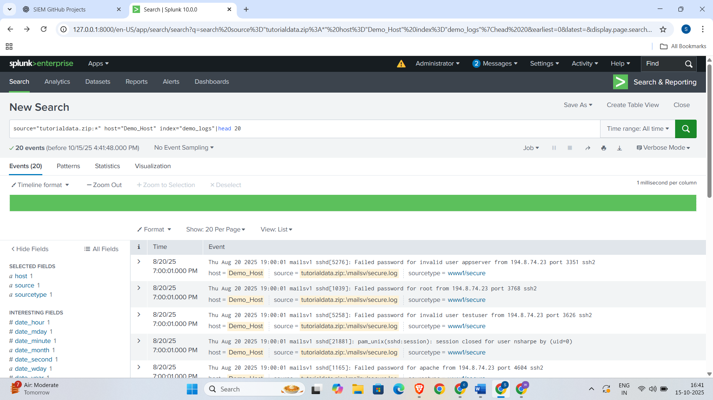

# SIEM Monitoring & Alerting Project (Splunk Demo)

## Project Overview
This project demonstrates practical experience in Security Information and Event Management (SIEM) using **Splunk Enterprise**. It covers key security operations tasks including:
- Log collection and processing.
- Development and configuration of **Correlation Rules** for common attack patterns (Brute Force, Privilege Escalation).
- Creation of **Real-time Alerts**.
- Design and implementation of a comprehensive **Monitoring Dashboard**.

## 1. Log Collection and Initial Data Exploration

The project utilizes sample `demo_logs` imported into Splunk.
Here's an example of the raw events being indexed:

## 2. Brute Force Detection

**Objective:** Identify multiple failed login attempts from a single source or user within a short timeframe. A threshold of more than 5 failed attempts within 5 minutes was set.

### A. Splunk Search Processing Language (SPL) for Detection
The following SPL query was developed to identify brute force attempts:
splunk
index="demo_logs" 
| rex "(?i)Failed password for (?<user>\w+) from (?<src_ip>\d+\.\d+\d+\.\d+\.\d+)" 
| eval action="failed" 
| bin _time span=5m 
| stats count AS failed_count, values(src_ip) AS src_ips by user, _time 
| where failed_count > 5 
| sort - failed_count 
| table _time user failed_count src_ips
