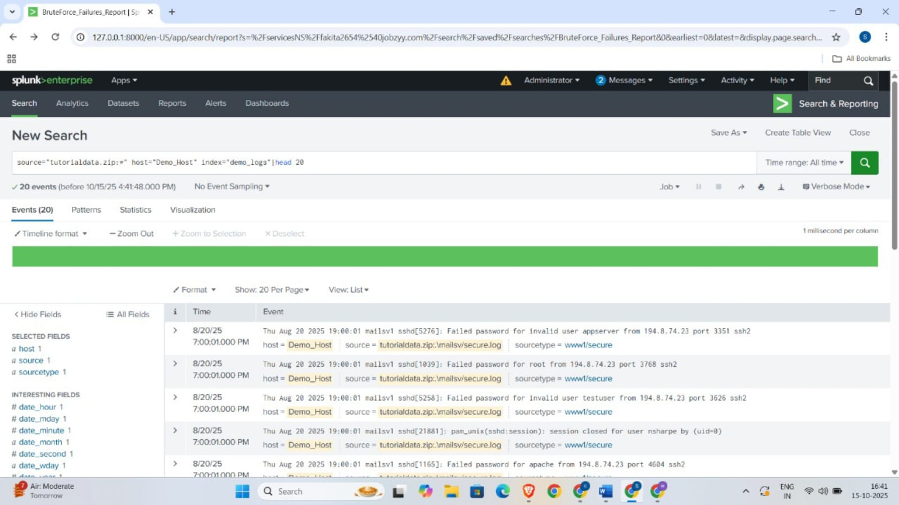
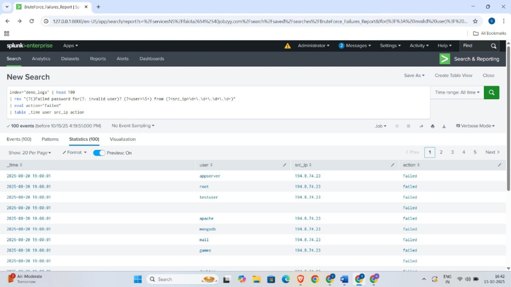

# SIEM Monitoring & Alerting Project (Splunk Demo)

## Project Overview

This project demonstrates practical experience in Security Information and Event Management (SIEM) using **Splunk Enterprise**. It covers key security operations tasks including:
* Log collection and processing.
* Development and configuration of **Correlation Rules** for common attack patterns (Brute Force, Privilege Escalation).
* Creation of **Real-time Alerts**.
* Design and implementation of a comprehensive **Monitoring Dashboard**.

---

## 1. Log Collection and Initial Data Exploration

The project utilizes sample logs imported into Splunk.

### A. Raw Events Ingestion

This screenshot confirms that the `tutorialdata.zip` logs were successfully ingested, indexed, and fields were being extracted for analysis.

[](https://github.com/Siddiksddu/SIEM-Monitoring-Project/blob/main/SIEM-MONITORING-1.jpg)

---

## 2. Brute Force Detection

**Objective:** Identify multiple failed login attempts from a single source or user within a short timeframe (threshold: >5 failures in 5 minutes).

### A. Initial Log Filtering

This initial view shows multiple failed login attempts against various users from the same source IP, indicating a reconnaissance phase.
[](https://github.com/Siddiksddu/SIEM-Monitoring-Project/blob/main/SIEM-MONITORING-4.jpg)

### B. Correlation Rule (SPL and Results)

The SPL uses `| stats count` and `| where` to isolate true brute-force attempts. The results confirm a single user had **123 failed logins**, validating the rule's effectiveness.
```splunk
index="demo_logs" 
| rex "(?i)Failed password for (?<user>\w+) from (?<src_ip>\d+\.\d+\d+\.\d+\.\d+)" 
| eval action="failed" 
| bin _time span=5m 
| stats count AS failed_count, values(src_ip) AS src_ips by user, _time 
| where failed_count > 5 
| sort - failed_count 
| table _time user failed_count src_ips
