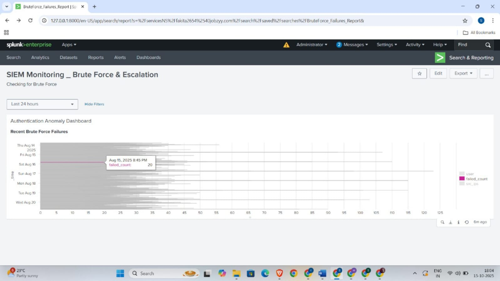

# SIEM Monitoring & Alerting Project (Splunk Demo)

## Project Overview

This project showcases a practical Security Information and Event Management (SIEM) implementation using **Splunk Enterprise**. It follows a strict workflow to detect and visualize two key threats: Brute Force attacks and Privilege Escalation attempts.

---

## 1. Project Setup: Log Ingestion and Filtering

This phase confirms that security logs are properly collected and prepared for analysis.

| Step | Description | Screenshot |
| :--- | :--- | :--- |
| **1.1 Ingesting Raw Logs** | The process begins by successfully ingesting security logs into Splunk. This view confirms successful data collection and shows raw event messages ready for field extraction. |  |
| **1.2 Filtering Logs** | This step confirms filtering down to the core logs (`index="demo_logs"`) where the suspicious activities (like `failed password`) are present, ensuring analysis is efficient. |  |

---

## 2. Brute Force Detection and Alerting

This workflow detects unauthorized high-volume login attempts and sets up real-time alerting.

| Step | Description | Screenshot |
| :--- | :--- | :--- |
| **2.1 Apply Threshold Logic** | This is the core detection step. The SPL uses `| stats count` to define the threshold (`> 5 failed logins`) and identifies the user ('root') with **123 failures** from multiple source IPs. |  |
| **2.2 Confirm Initial Alert** | This view demonstrates the detection logic is operational, confirming an initial event count (5 failed logins) that is ready to trigger the alert threshold. |  |
| **2.3 Configure Real-time Alert** | The final detection search was saved as a **Real-time Alert**. It is configured for immediate triggering, which is crucial for minimizing the detection gap during an attack. |  |

---

## 3. Privilege Escalation Monitoring

This workflow analyzes user behavior across sessions to identify suspicious privilege changes.

| Step | Description | Screenshot |
| :--- | :--- | :--- |
| **3.1 Session Correlation** | A `transaction` search is used to group related events (like failed and successful logins) by user and IP, tracking session duration and event count—a necessary precursor to privilege analysis. |  |
| **3.2 Escalation Detection Logic** | The SPL uses `stats max(privilege_level)` vs. `min(privilege_level)` to detect escalation. The result shows **"No"** under 'Escalation', which **validates the rule's functionality** even though no malicious event was present in the demo data. |  |

---

## 4. Final Monitoring Dashboard

The dashboard provides visual context for detected attacks, aiding rapid security investigation.

| Step | Description | Screenshot |
| :--- | :--- | :--- |
| **4.1 Dashboard Visualization** | The final dashboard uses an **Event Chart** to visually illustrate the **sustained volume and time spread** of the brute force attempts over several days, providing instant pattern recognition. |  |
| **4.2 Metric Confirmation** | This zoomed view confirms that the dashboard panel accurately tracks the core `failed_count` metric over time, ensuring the visualization directly reflects the detection logic. |  |

---

## Conclusion

This project successfully demonstrates hands-on proficiency in fundamental SIEM operations: **log analysis**, **correlation rule development**, **real-time alerting**, and **professional dashboard creation**.
